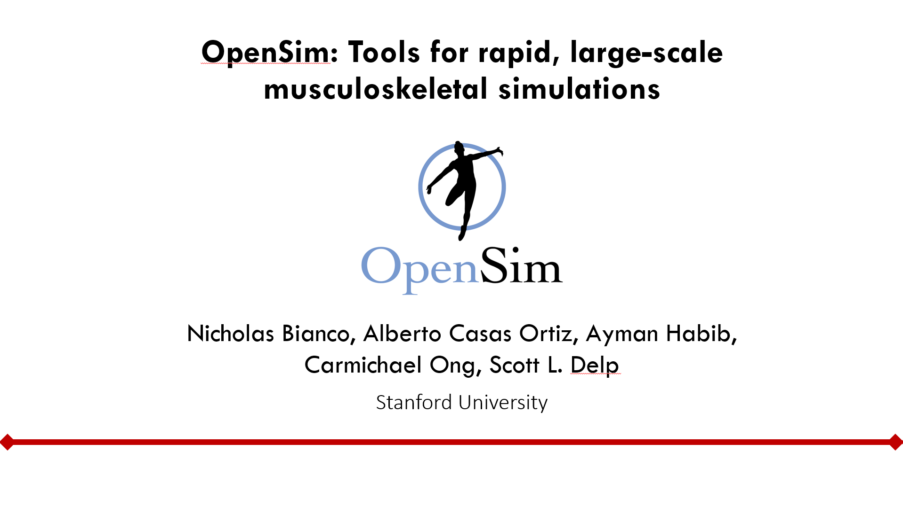

The OpenSim Team will host a hands-on software workshop on Wednesday July 31st at the [19th International Symposium on Computer Methods in Biomechanics and Biomedical Engineeering (CMBBE 2024)](https://www.cmbbe-symposium.com/2024/). Details about the workshop content and instructions for setting up simulation environments for the hands-on software demos can be found below.

# Overview

Musculoskeletal simulations provide a way to gain deep insights into how movement is coordinated. New tools for rapidly developing musculoskeletal simulations are enabling more researchers to leverage simulations by reducing the barrier to entry. In this workshop, we will present how our ecosystem of OpenSim tools for rapidly creating simulations, including from smartphone videos using OpenCap, and new features we’ve added to our Python and Jupyter notebook interfaces make it easier to generate simulations. With a combination of didactic portions and hands-on examples, participants will learn about OpenSim’s tools for creating simulations, and how to import movement data, create muscle-driven simulations, and analyze the results.

Attendees will learn:

- To understand the capabilities of tools available in the OpenSim ecosystem, including OpenCap for motion capture with smartphones
- To write Python code and use Jupyter notebooks to generate, analyze, and share simulations
- To understand validation approaches and potential research applications of the software

# Setup instructions

The first portion of the workshop will demonstrate OpenCap. There is no interactive segment for this software demonstration, but sample files are included in this repository:

* [Demo 1: Recording movement data from smartphones with OpenCap](https://app.opencap.ai/session/c601e008-4fd0-492a-b675-04667c4df1c4)

The second and third portions of the workshop will demonstrate how to utilize the Python scripting interface in OpenSim to perform analyses, create visualizations, and generate muscle-driven simulations. We will use interactive Jupyter notebooks to demonstrate the OpenSim Python interface, and you may use these notebooks follow along with each software demonstration during the workshop.

Please follow the instructions below to set up each Jupyter notebook using either Google Colab (recommended) or via manual installation.

## Google Colab

Google Colab is a free service for hosting Jupyter notebooks in the cloud along with computing services. The [condacolab](https://github.com/conda-incubator/condacolab) project enables install Conda environments directly into a Jupyter notebook. We have designed this workshop around Google Colab and condacolab to streamline setting up Python environments with OpenSim, and we highly recommmend participants use this option.

To get started, simply click the links below to open the interactive Jupyter notebook for each software demonstration.

* Demo 2: Analyzing and visualizing movement data with OpenSim (TODO)
* [Demo 3: Creating muscle-driven simulations with OpenSim Moco](https://githubtocolab.com/opensim-org/CMBBE2024/blob/main/Demo3_OpenSimMoco/Demo%203%20-%20Muscle-driven%20Simulations%20with%20OpenSim%20Moco.ipynb)
    * Trying running Section 3.2 on your own to install most of the software prerequisites for this demo.

## Manual installation (not recommended)

1. Clone this repository
2. Create a new conda environment
3. Install OpenSim: `conda install opensim_admin::opensim-moco`
4. Install the following packages (TODO)
    - ipywidgets

Notes
1. Skip any sections involving setting up `condacolab`
2. Skip any sections involving downloading resources, they will be included in the cloned repository.
3. Sections involving the OpenSim Viewer are not guaranteed to work out-of-the-box.
    - As an alternative, the Simbody visualizer can be enabled for certain sections.

# Resources

* OpenSim 4.5.1 API documentation (TODO)
* OpenSim scripting in Python (TODO)
* View the [workshop Confluence page](https://opensimconfluence.atlassian.net/wiki/spaces/OpenSim/pages/226394116/CMBBE+2024+OpenSim+Workshop) for additional resources, including the workshop presentation slides.